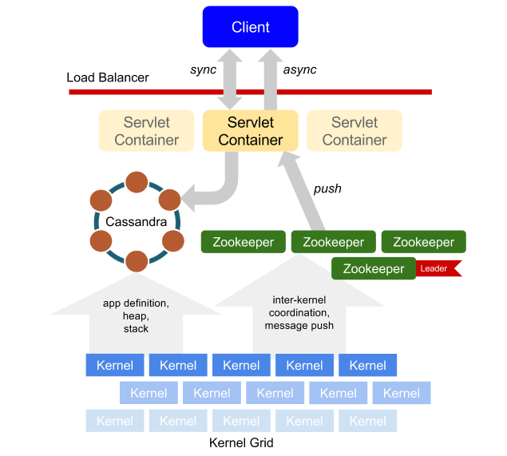

Copyright &copy; 2015. Dan Mascenik. All Rights Reserved.

# Getting Started with ePlunum
[&laquo; Home](README.md)

### Prerequisites

Getting started quickly with ePlunum only requires Java 8 and Docker. All of ePlunum's components may be packaged in a single Docker container or in their own containers. However, for larger production installations, containers are less practical and experience with Cassandra and ZooKeeper is recommended.

Ensure that you have the following installed:

* [Java 8](http://www.oracle.com/technetwork/java/javase/downloads/index.html)
* [Docker](https://docs.docker.com) (and ```boot2docker``` for Windows and Mac OSX users)

Check that Java and Docker (and boot2docker) are on your path:

```
$ java -version
java version "1.8.0_25"
Java(TM) SE Runtime Environment (build 1.8.0_25-b17)
Java HotSpot(TM) 64-Bit Server VM (build 25.25-b02, mixed mode)
$ docker -v
Docker version 1.6.1, build 97cd073
$ boot2docker -v
Boot2Docker-cli version: v1.6.1
Git commit: 076b58d
...
$
```

#### Install the ePlunum Standalone Container

Once you have Java 8 and Docker installed, you are ready to download and run the ePlunum standalone container. This container provides a single ePlunum grid node and all of its dependencies. If you are using Windows or Mac OSX, be sure to run ```boot2docker up``` to launch the Docker host VM before you continue.

Follow [these instructions](docker-standalone.md) to install the standalone container.


### Using the Command-Line Client

The ePlunum platform exposes a REST API for managing and connecting to application instances. Events from clients (or the Internet at large) are processed asynchronously on the grid, and any resulting messages are pushed to clients via a WebSocket connection. The ePlunum Command-Line (CLI) client provides application and instance management via the REST API, but can also *attach* to a running instance's output stream to inspect messages that the instance is generating.

The CLI client is launched by running `./eplunum` on *NIX platforms or `eplunum.bat` on Windows. With no arguments, the client will attempt to connect to a standalone ePlunum server running at `localhost:8080`. If the server is running inside a VM, which is the case when running Docker containers on Mac OSX or Windows via `boot2docker`, the IP of the host must be used.

For example, use the following command to connect to the ePlunum standalone Docker container:

```
$ ./eplunum `boot2docker ip`:8080
```

If this doesn't work, try the default `boot2docker` host IP:

```
$ ./eplunum 192.168.59.103:8080
```

Multiple servers may be provided as a comma-separated list of &lt;ip_address&gt;:&lt;port&gt; pairs. The client will connect to the first available server, and attempt to reconnect to the next in round-robin if the connection is lost. For example:

```
$ ./eplunum 192.168.0.100:8080,192.168.0.101:8080,192.168.0.102:8080
```

Once the client is started, the `help` command provides a list of all the available commands. Syntax of any command can be found by typing the command followed by the `-h` or `--help` flag. Typing `help <command>` provides detailed usage information.


### Hello World!

ePlunum is extensible to support any programming language, but the JavaScript extension is included out of the box, so this is a good place to start. Writing a *Hello World* application is as simple as this:

***hello-world.js***

```
print("Hello World!");
```

Before this simple program can be run, it needs to be imported into ePlunum using the CLI client:

```
eplunum> import <path-to-file>/hello-world.js
65f37988-4202-4398-aa50-55d5ae361437 (hello-world.js)
eplunum>
```

The string of characters followed by the application name is the unique ID of the application in ePlunum. This ID is used to reference the application when performing any actions related to it, such as starting a new instance. Don't worry about remembering it. You can always find out the ID of an application in your environment by running the `ls --app` command.

Run the application like this:

```
eplunum> run 65f37988-4202-4398-aa50-55d5ae361437
Started hello-world.js
eplunum>
```

Uh oh, wasn't it supposed to print "Hello World?" The `print` function provided with ePlunum's JavaScript extension pushes text to the application instance's output stream. A client must `attach` to the instance to receive its output.

First, use the `ps` command to get the unique ID of the application instance:

```
eplunum> ps

Instances:
ID                                     APPLICATION
50c904a4-b4d2-476c-99fd-bd70f15ae412   65f37988-4202-4398-aa50-55d5ae361437 (hello-world.js) ACTIVE

eplunum>
```

Now we can attach to the instance's output stream:

```
eplunum> attach 50c904a4-b4d2-476c-99fd-bd70f15ae412
Attached to instance 50c904a4-b4d2-476c-99fd-bd70f15ae412 - Type "q" to detach
eplunum> Hello World!
q

eplunum>
```

Woohoo! There it is - the last value pushed to the output stream! The client remains attached to the instance in case it prints something else. We know it won't, though, so type `q` to detach from the instance and return to the command prompt. The ePlunum CLI client simply prints the incoming stream to the terminal, but you could also write a JavaScript client to handle incoming JSON chunks however you like.


### Sample Apps

The ePlunum CLI client comes with a few simple example applications in the `samples` folder. Give these a try, then try writing some of your own. Before you do, though, here are some things to note:

#### Limitations of Version 0.1a

Significant bits of functionality are being added in every alpha release, but for now...

1. Despite being an event-driven platform, ePlunum currently only responds to one event - application launch. Eventually, functions may be triggered by a variety of external signals, but for now, everything is basically a static initializer.

2. **No function definitions.**

3. **No complex types.** Only the basic primitives are currently supported.

4. **No fancy stuff.** This version supports basic flow control (if, else, for, while, etc...), mathematical operations and string concatenation. You can also use the built-in functions `print` and `sleep`. If you happen to use an unsupported feature, you will get an `Error: Unsupported <feature/token/etc>` message when you try to `import`. If you supplied invalid JavaScript (a syntax error), the word "unsupported" will not be present in the error message.


#### infinite-loop.js

Demo'ed in the *Introduction to ePlunum* webcast, this is a simple counter that writes a forever-incrementing integer to the output stream. It's the simplest demonstration of streaming data to a client. In a clustered environment, it can be used to demonstrate state preservation despite node failures.


#### infinite-loop.xml

This is the transcoded version of **infinite-loop.js** represented as XML. It does exactly the same thing as the JavaScript version, but gives you a glimpse into how ePlunum could be extended to handle other languages than JavaScript - all you need is a parser.

Note that this file can also be imported into ePlunum using the `-o` flag (object code):

```
eplunum> import -o samples/infinite-loop.xml
```

#### syntax-error.js

Demonstrates what happens if you break the JavaScript parser (Mozilla Rhino).


#### unhandled-token.js

Demonstrates what happens if you try to use an operation not supported in this version of ePlunum (in this case, a bit-shift operation).


### Cluster Topology

The standalone Docker container is a good way to get started, but the real value of ePlunum is its resilience when running in a cluster.

***High-Level Cluster Architecture***




Clients interact with the REST and WebSocket API provided by a layer of stateless servlet containers. Applications are transcoded into ePlunum's native object format and stored in Cassandra. Triggering events and kernel coordination are handled by Zookeeper.

> **Coming Soon**
> 
> Cluster configuration details